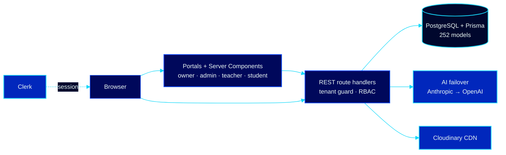

# Leora School Assistant — Technical Showcase

> Multi-tenant school-management SaaS for Tanzanian secondary schools.
> **Status:** in active development (~231,000 lines) · **Role:** architect & sole developer · **Since:** June 2026

This repository is a **technical overview only** — the production codebase is proprietary and kept private. Here is what the system is, how it is engineered, and the constraints it is built around.

## The problem

Tanzanian secondary schools run on paper registers, WhatsApp groups and disconnected spreadsheets: grades are computed by hand against NECTA rules, attendance is a paper register, discipline has no record, fees are tracked in exercise books, and parents hear about problems too late. Existing school software is either imported (wrong curriculum model, USD pricing, no offline reality) or a single-tenant per-school install that nobody maintains.

## The solution

One platform, many schools. Each school is an isolated tenant with its own staff, students, classes, grading scales, branding and billing — while sharing one codebase and one operational model designed around how Tanzanian schools actually work.

**252 database models · 500+ API route handlers · 390+ pages** — Next.js 16, TypeScript, PostgreSQL, Prisma, Tailwind CSS 4.

## Core modules

| Module | What it does |
|---|---|
| 🎓 **Academics & grading** | NECTA-aligned grading system with authority chains (who proposes → who reviews → who approves), exam workflows and report generation |
| 📚 **Curriculum** | TIE-aligned curriculum structures, subject allocations and competency tracking |
| 🗓️ **Attendance** | Daily & per-lesson attendance for students and staff, with trend analytics per class and per student |
| 🛡️ **Discipline** | Structured incident log with severity, follow-up actions and KPI tracking for school leadership |
| 💳 **Finance & billing** | Fee structures, invoices, payments and bursar workflows, plus hotspot/billing integration for school networks |
| 📣 **Communication** | Parent communication, announcements and notification workflows |
| 🧑‍💼 **Portals** | Distinct role experiences: owner, headmaster/admin, academic master, exams officer, HOD, bursar, HR, class teacher, teacher, and student portal |
| 🤖 **AI insights** | Per-module AI insight cards (provider failover: Anthropic → OpenAI) for summaries and anomaly flags |
| 🎨 **Branding & identity** | Per-tenant school branding with role-aware badge tiers and verified identity |

## Architecture

**Multi-tenancy** — every query is tenant-scoped at the data-access layer; cross-tenant reads are structurally guarded, not conventionally avoided. Role-based access control separates platform administration from school administration from staff from students, with supplemental roles (class teacher, teacher-on-duty) that activate contextually.

**Engineering rules the codebase enforces** — additive-only schema evolution (no destructive migrations, soft deletes only), every API response validated before rendering, secrets never committed, and CI gates that run type-checking and tests before any merge. Screens, dropdowns and layout follow one internal design system so 390+ pages stay consistent.

## Stack

| Layer | Choice |
|---|---|
| Framework | Next.js 16 (App Router, Turbopack), React, TypeScript |
| UI | Tailwind CSS 4, shadcn/ui (Base UI primitives), Recharts, Liquid Glass dashboard system |
| Database | PostgreSQL + Prisma ORM (252 models, additive-only migrations, audit logging) |
| Auth | Clerk |
| AI | Anthropic → OpenAI provider failover |
| Infra | Vercel / Render, Cloudinary CDN, GitHub CI checks |

## Why this project matters

It is designed for the environment it serves: Swahili + English, TZS finance, NECTA/TIE compliance, low-bandwidth schools, and school staff who are not software experts. The goal is 100+ schools on one platform with data isolation they can trust.

---

### © & License

**© 2026 Claytone Curthberth Mhina · Leora Tech Solutions. All rights reserved.**

No license is granted for the artwork, animated banners, diagrams or text in this repository. Copying, modification, redistribution and derivative works are prohibited without written permission. Reach me at **claytonecurth@gmail.com** for licensing or walkthroughs.

